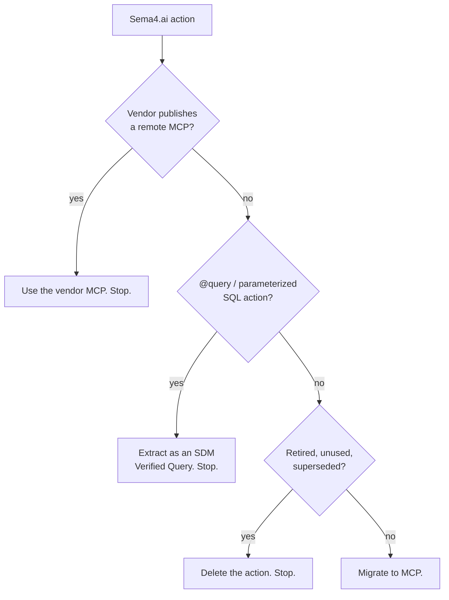

# Decide what to do with your action

Not every Sema4.ai action should become an MCP server. Walk this decision tree
in order and **stop at the first yes**.

## 1. Does the vendor already publish a remote MCP?

Many vendors now ship an official remote MCP — GitHub, Atlassian, Notion,
Linear, Stripe, Slack, and a growing list. Sema4.ai also maintains a small
hosted gallery for common providers.

**Signals:**

- The vendor has an `/mcp` endpoint or a "MCP Server" page in their docs.
- Sema4.ai's hosted gallery already lists the provider your action wraps.
- Your action was mostly a thin pass-through over the vendor's public API.

**What to do:** wire your agent to the vendor MCP and retire the action.
Verify tool coverage against your action's surface — occasionally a vendor
MCP omits something you relied on. In that case you still migrate, but only
the gap, not the full pack.

**Stop.**

## 2. Is this a `@query` / parameterized-SQL action?

SQL-first actions belong in the Semantic Data Model, not in an MCP. SDM is
the only non-MCP target currently in scope for this guide.

**Signals:**

- `@query` decorator from `sema4ai.actions` or `sema4ai.data`.
- `DataSource` / `DataSourceSpec` types in `data_sources.py`.
- A SQL string in the function body with `$variable` placeholders.
- A Pydantic model used as the parameter container.

**What to do:** extract each `@query` into an SDM **Verified Query** in the
agent.

- Keep the function name, docstring summary, and parameter shape.
- Convert `$var` placeholders to `:var`.
- Flatten dynamic `WHERE` clauses (e.g. `where_conditions.append(...)`) into
  a single static SQL with optional conditions joined by `AND`.
- Drop Python string formatting (`f"""…"""`) — output plain SQL.
- Preserve table and schema references exactly.

> **One data source per SDM.** If a `@query` joins across two data sources it
> cannot become a single Verified Query — either split the query or keep it
> as an MCP tool (rare, and only when heavy Python logic is involved).

The `convert-action-pack` skill (shipping in the next batch) extracts ready-
to-paste Verified Query definitions.

**Stop.**

## 3. Is this action retired, unused, or superseded?

Check Studio telemetry or talk to the agent owner before assuming an action
is alive. An action with no recent invocations is usually a deletion
candidate — one fewer thing to migrate, host, and maintain.

**Signals:**

- No invocations in the last 90 days.
- Action was built for a workflow that's since been discontinued.
- A newer action in the same pack already subsumes its job.
- The only agent calling it is itself deprecated.

**What to do:** delete the action. If the whole pack is retired, delete the
pack.

**Stop.**

## 4. Otherwise — migrate to MCP

If none of the above fired, the action is a real candidate for MCP conversion.

- Understand the shift first: [mental model](02-mental-model.md).
- Then run the migration workflow: `04-migration-workflow.md` *(coming next
  batch)*.
- The `convert-action-pack` skill handles inventory, auth classification, and
  scaffolding for you.

## A few tips

- **SQL somewhere doesn't make it SDM.** Only actions whose primary work is
  a parameterized SQL query belong in SDM. An action that hits a warehouse
  once to enrich an LLM result, or mixes SQL with substantial Python, stays
  as an MCP tool.
- **Vendor MCPs are a moving target.** The list of vendors publishing one
  grows quickly. If you last checked a few months ago, it's worth another
  look before you invest in migrating.
- **An action kept alive only by a deprecated agent is still dead code.**
  Retire the agent first, then the action.
- **Low-traffic actions are good deletion candidates.** Fewer MCPs means
  less to host and maintain — worth asking whether each one still earns
  its keep.
